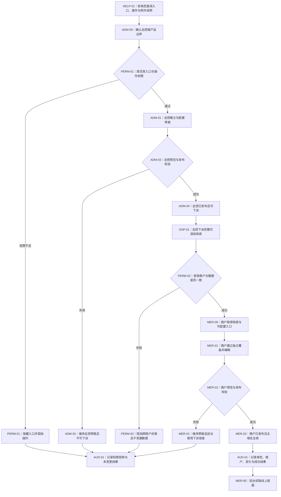
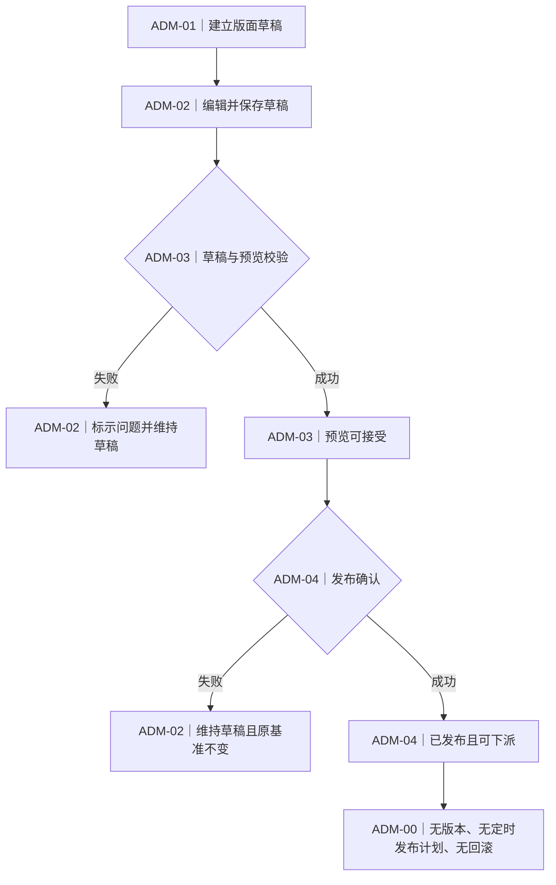
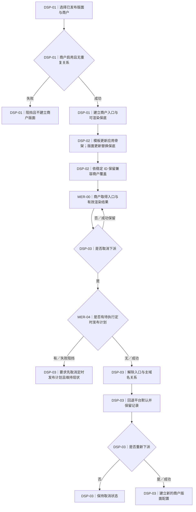
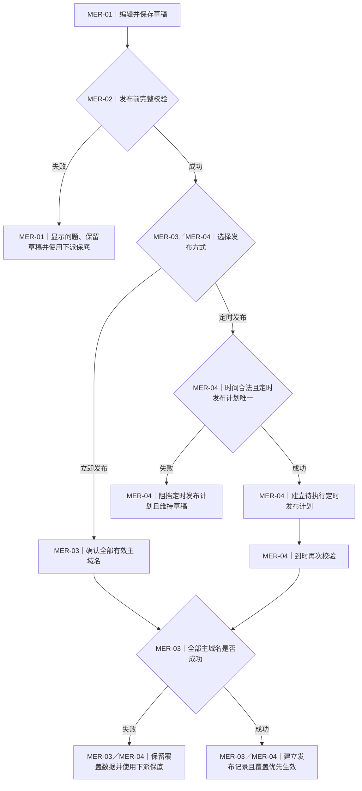
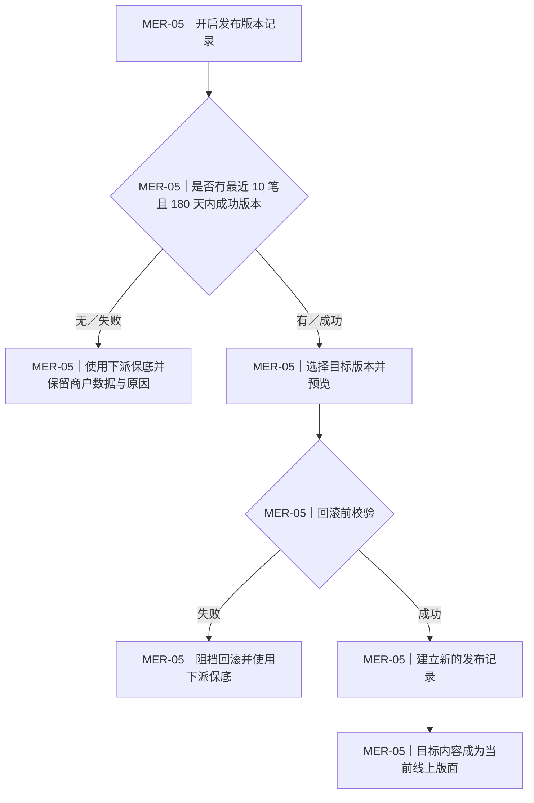
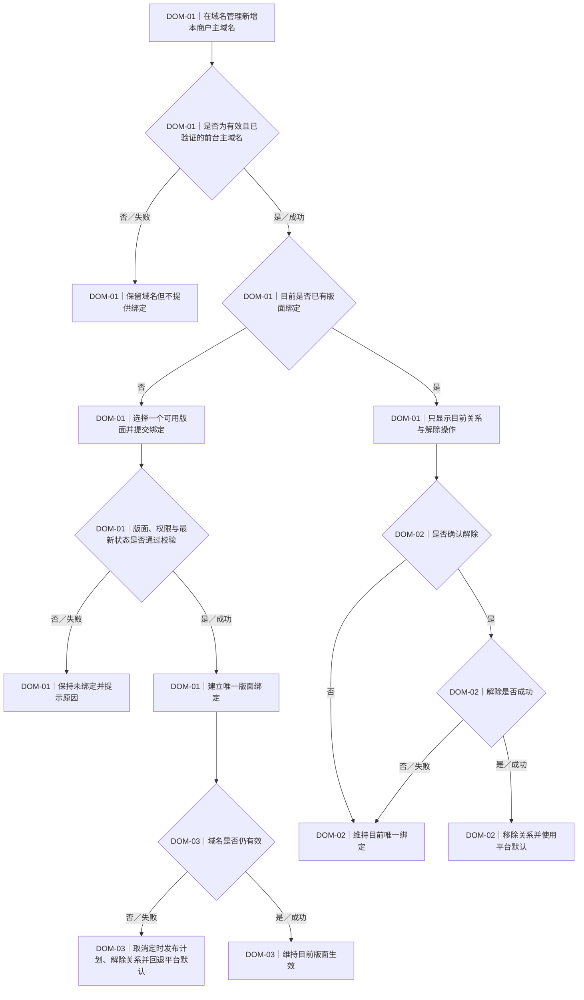
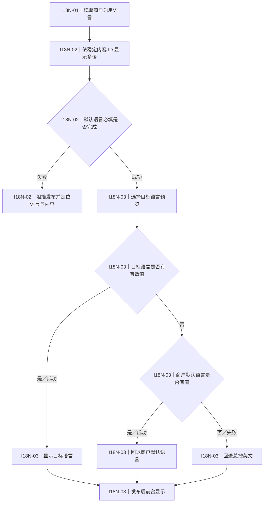
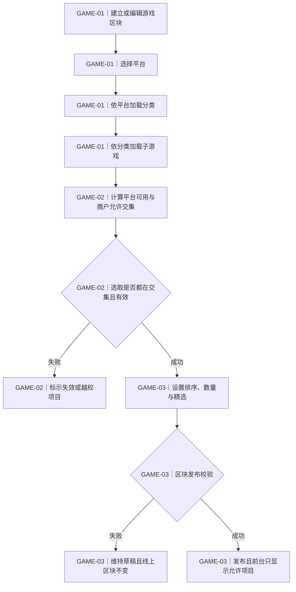

# AR 前端自定义配置 PRD 规范

- 文件状态：产品与验收基准
- 最后更新：2026-08-07
- 适用端：总控端 3200、商户端 3100、PC 管理界面与手机前台输出
- 文件用途：记录产品操作、开发边界及验收基准；第 8、9 章分别提供接口表与字段表索引，完整契约由相关开发文件承载，不在原型画面展示

## 1. 文件范围

### 1.1 产品目标与适用范围

本功能以代码内固定模板提供前端宏观页面架构，让总控端建立、预览、发布并下派可直接渲染的版面保底；获得下派的商户可在授权范围内建立独立覆盖内容、预览 PC 与手机效果，并通过立即发布、定时发布或回滚控制线上前台。

- 总控端：版面列表、建立、复制、编辑、预览、发布、下派、取消下派、停用与审计查询。
- 商户端：版面列表、复制既有版面、内容编辑、预览、域名管理、立即发布、定时发布、取消定时发布计划、回滚与审计查询；不提供空白新增版面。
- 共用能力：代码模板、主题、版面、组件稳定 ID、多语、游戏阶层、权限、商户隔离、保底与覆盖边界、状态转移与异常保护；只有已验证且启用的前台主域名可应用版面。同一版面可应用多个主域名，但同一主域名任何时间只应用一个当前版面。
- 预览：手机固定使用 375 × 812 px 窗口；PC 固定以 1920 px 宽度预览，高度不限制，内容依画面宽度自适应；预览与正式前台使用相同渲染规则。
- 前台结果：商户覆盖有效时优先展示覆盖内容；覆盖加载、校验、发布或渲染失效时直接展示目前有效的下派保底；草稿及预览数据不得进入线上结果。

会员、钱包、投注、支付、活动引擎及与前端版面配置无直接关系的模块不在本文范围。

### 1.2 保留理由检查

本文每一节均须直接归属操作、开发或验收；不能归类者不纳入本文。

| 类别 | 保留理由 | 对应章节 |
|---|---|---|
| 操作 | 定义角色入口、功能点、可操作范围、操作结果及产品功能流程图 | 第 2、3、5 章 |
| 开发 | 定义数据关系、稳定 ID、同步边界、状态转移、持久化、必要 UI 状态，以及接口与字段追溯 | 第 4、5、8、9 章 |
| 验收 | 定义可逐条判定的前置条件、操作、预期结果与完成标准 | 第 6、7 章 |

### 1.3 文件与画面边界

- 原型必须能操作完整功能并保留跨页状态，但不得在画面显示接口名称、字段实体、内部数据来源名称或技术判断。
- 画面可显示用户能理解的加载、空、失败、权限不足、数据已更新与发布结果。
- PRD 第 8、9 章只保留接口与字段的数量、分组、责任边界及追溯索引；详细传输、数据格式与保存规格只在独立明细档维护。
- 验收以用户可观察的功能结果为准，不以工程接口字样作为验收内容。

## 2. 角色、系统边界与数据关系

### 2.1 总控与商户边界

#### ADM-00｜总控端产品边界

1. **适用端／角色／页面入口：** 总控端 3200；总控管理员；前端自定义配置入口。
2. **功能目的：** 使用代码模板建立可发布及可下派的完整版面保底，并限制总控更新不得改写商户覆盖内容。
3. **前置条件与触发方式：** 管理员已登录且具相应查看、编辑或发布管理权限；进入功能或操作平台版面。
4. **操作步骤：** 进入列表，建立或编辑版面，预览，发布，再依需要下派。
5. **状态或数据变化：** 平台版面依草稿、已预览、已发布转移；发布后形成含基本排版、模块展示数量及游戏内容的完整可渲染保底。
6. **成功结果：** 已发布版面可供下派；后续模板更新只应用新版代码骨架与能力，版面更新只更新下派保底，均不覆盖商户已配置或已发布覆盖。
7. **失败／空状态／权限不足／并发例外：** 校验失败维持草稿；空列表提供建立入口；无权限不显示入口；数据已更新时要求重载。
8. **对应字段实体／字段编号：** ENT-PLATFORM-LAYOUT；FLD-ADM-001 至 FLD-ADM-008。
9. **对应接口编号：** API-ADM-001 至 API-ADM-004。
10. **权限与审计要求：** 沿用查看、编辑、发布管理；建立、保存、预览、发布、停用均记录。
11. **对应验收案例与通过标准：** [TC-ADM-01](#tc-adm-01)、[TC-ADM-02](#tc-adm-02)；总控操作不得直接改写商户覆盖，只有模板能力与下派保底依规则更新。
12. **对应流程图图号及图中节点：** [图 1](#fig-01) ADM-00 节点、[图 2](#fig-02) ADM-01 至 ADM-04 节点。

#### MER-00｜商户端产品边界

1. **适用端／角色／页面入口：** 商户端 3100；商户管理员；已下派版面列表入口。
2. **功能目的：** 允许商户在平台授权边界内配置与发布本商户前台，且不影响其他商户或平台基准。
3. **前置条件与触发方式：** 商户启用、已获有效下派且登录身份与商户一致。
4. **操作步骤：** 进入已下派版面；需要新草稿时只能复制既有版面并直接进入新版面编辑页；完成允许内容的编辑、预览、校验后立即或定时发布，必要时回滚。
5. **状态或数据变化：** 商户版面形成独立草稿、定时发布计划、发布记录与覆盖数据；下派保底与商户覆盖分层保存。
6. **成功结果：** 有效商户覆盖优先于保底；总控更新不覆盖商户覆盖，也不影响其他商户数据。
7. **失败／空状态／权限不足／并发例外：** 未下派显示无可配置版面，且不显示空白新增入口；商户覆盖失效时使用目前有效下派保底；权限不足不可变更；并发更新禁止静默覆盖。
8. **对应字段实体／字段编号：** ENT-MERCHANT-LAYOUT；FLD-MER-001 至 FLD-MER-010。
9. **对应接口编号：** API-MER-001 至 API-MER-006。
10. **权限与审计要求：** 依商户查看、编辑、发布管理拆分；所有数据变更带入登录商户并记录。
11. **对应验收案例与通过标准：** [TC-MER-01](#tc-mer-01)、[TC-PERM-01](#tc-perm-01)；入口、数据与线上结果均须商户隔离。
12. **对应流程图图号及图中节点：** [图 1](#fig-01) MER-00、MER-01、MER-02、MER-03 节点。

#### 2.1.1 产品功能流程图 1｜全局角色与数据流

**功能目的：** 说明用户如何依说明书与权限进入功能，以及总控基准如何经下派、商户配置、预览、发布与审计成为前台结果。

**适用角色：** 总控管理员、商户管理员、前台访客。

**触发条件：** 用户查阅说明、登录受控入口、总控建立新版面，或准备把已发布版面提供给商户使用。

操作与开发规则：入口与操作先检查角色权限，商户操作再检查商户身份；代码模板、下派保底与商户覆盖分层保存；下派成功即提供完整可渲染保底，商户发布成功后以覆盖内容优先；覆盖失效时直接读取目前有效保底；重要成功与失败结果均留下审计。

**成功分支：** [HELP-01](#fp-help-01) 提供入口与操作说明；[PERM-01](#fp-perm-01) 与 [PERM-02](#fp-perm-02) 校验通过后，[ADM-04](#fp-adm-04) 发布成功并由 [DSP-01](#fp-dsp-01) 下派完整保底；[MER-03](#fp-mer-03) 发布成功后由 [AUD-01](#fp-aud-01) 记录，前台在有效商户覆盖与下派保底间依优先序取值。

**失败分支：** [PERM-01](#fp-perm-01) 阻挡无权限入口，[PERM-02](#fp-perm-02) 阻挡跨商户存取；[ADM-02](#fp-adm-02) 保留总控草稿；[MER-01](#fp-mer-01) 保留商户草稿，覆盖失效时前台使用下派保底；[AUD-01](#fp-aud-01) 记录拒绝或失败结果。

**关键规则：** [ADM-00](#fp-adm-00) 与 [MER-00](#fp-mer-00) 数据分层；权限与商户隔离不可由直接页面地址绕过；模板更新只更新代码骨架与能力，版面更新只更新保底，均不得覆盖商户覆盖；说明书不改变产品数据。

**例外：** 商户没有有效主域名时可编辑与预览，但不能发布、定时发布计划或设为默认。

**验收条件：** [TC-ADM-01](#tc-adm-01)、[TC-DSP-01](#tc-dsp-01)、[TC-MER-02](#tc-mer-02)、[TC-PERM-01](#tc-perm-01)、[TC-AUD-01](#tc-aud-01)、[TC-HELP-01](#tc-help-01) 分别验证说明、权限、数据流、成功、失败与审计结果。

### 2.2 权限、入口与商户隔离

#### PERM-01｜角色权限与入口

1. **适用端／角色／页面入口：** 总控端与商户端；所有管理角色；V3 角色管理及前端自定义配置入口。
2. **功能目的：** 沿用 V3 角色配置，以查看、编辑、发布管理三个基础权限点控制入口与操作，不建立本功能专属角色体系。
3. **前置条件与触发方式：** 角色已配置权限；登录、开启页面或执行受控操作时触发。
4. **操作步骤：** 检查登录角色与功能点，显示允许入口及按钮，对未授权操作阻挡。
5. **状态或数据变化：** 权限本身由 V3 管理；本功能不自行改写角色设置。
6. **成功结果：** 查看者可读与预览；编辑者可改草稿；发布管理者可发布、定时发布计划、回滚、下派及取消。
7. **失败／空状态／权限不足／并发例外：** 无查看权限不显示入口；直接输入页面地址亦阻挡；权限被收回时后续操作立即失效。
8. **对应字段实体／字段编号：** ENT-ROLE-PERMISSION；FLD-PERM-001 至 FLD-PERM-004。
9. **对应接口编号：** API-PERM-001。
10. **权限与审计要求：** 权限拒绝需记录角色、商户、操作及时间，不记录敏感内容。
11. **对应验收案例与通过标准：** [TC-PERM-01](#tc-perm-01)；按钮隐藏与执行阻挡需同时成立。
12. **对应流程图图号及图中节点：** [图 1](#fig-01) PERM-01 权限判断、通过与阻挡节点。

#### PERM-02｜商户身份与数据隔离

1. **适用端／角色／页面入口：** 商户端；商户管理员；所有列表、详情、预览、发布、域名、语言、游戏与审计页。
2. **功能目的：** 确保登录商户只能看到及变更自己的数据。
3. **前置条件与触发方式：** 登录内容含商户身份；每次进页、查询或变更时触发。
4. **操作步骤：** 依登录商户加载数据，核对页面所属商户，越权时返回安全入口。
5. **状态或数据变化：** 合法操作只更新登录商户数据；越权操作不产生变化。
6. **成功结果：** 列表、状态、发布结果、域名与审计皆无跨商户内容。
7. **失败／空状态／权限不足／并发例外：** 页面地址不一致时不显示目标商户名称、数据或是否存在；返回权限不足结果。
8. **对应字段实体／字段编号：** ENT-MERCHANT-SCOPE；FLD-PERM-005 至 FLD-PERM-008。
9. **对应接口编号：** API-PERM-002。
10. **权限与审计要求：** 所有权限拒绝与越权尝试需记录；审计查询本身亦受商户隔离。
11. **对应验收案例与通过标准：** [TC-PERM-01](#tc-perm-01)；任一商户不得读取或变更其他商户数据。
12. **对应流程图图号及图中节点：** [图 1](#fig-01) PERM-02 商户身份判断、通过与跨商户阻挡节点。

### 2.3 数据关系摘要

核心关系为「代码模板 → 总控版面 → 下派保底快照 → 商户覆盖配置 → 有效渲染结果 → 主域名当前指向」。模板、版面、主题、插槽、组件、语言、游戏及域名均以稳定 ID 关联，显示名称变更不得破坏既有配置。

| 配置面向 | 总控端 | 商户端 |
|---|---|---|
| 模板 | 由前端与后端写在代码内，固定定义顶部导航、底部导航、Banner、跑马灯等宏观架构、插槽契约与能力；管理界面不可建立、命名、复制或停用模板 | 自动应用新版代码骨架与能力；不可修改模板结构及其视觉规格 |
| 主题 | 只定义色彩系统，不包含形状、描边、圆角、间距等模板规格 | 只能在允许色彩项内覆盖，不可增加未授权色彩项或覆盖模板规格 |
| 版面 | 可建立、命名、编辑、复制、停用，并配置模块、区块、顺序、展示数量、游戏及其他细部内容；发布后可形成完整保底 | 使用下派保底；商户调整只建立覆盖，可调整允许的显示、排序与内容，不可改稳定 ID |
| 语言 | 定义总控英文基准与可用内容 | 依商户启用语言填写、保留及回退 |
| 游戏 | 定义平台、分类及子游戏来源 | 只能选商户允许范围与平台可用范围的交集 |
| 域名 | 不绑定商户域名 | 商户在域名管理新增与配置主域名；一个版面可绑多个主域名，每个主域名任何时间只应用一个当前版面；商户版面编辑页不展示域名字段 |
| 发布 | 发布平台基准；无定时发布计划、版本历程与回滚 | 支持立即发布、定时发布、取消定时发布计划、版本查看与回滚 |

模板或版面更新后，对应商户端的取值与保留规则如下：

- 模板更新只应用新版代码骨架、插槽契约与能力，不直接写入商户内容。
- 版面更新只替换对应商户的下派保底快照，包括保底排版、模块、展示数量及游戏内容，不修改商户草稿或已发布覆盖。
- 渲染时依稳定 ID 应用商户覆盖；仍兼容的覆盖持续优先，新增项目使用新版保底。
- 新版模板移除插槽时，该插槽的商户值保留于数据与审计但不展示；日后以相同稳定 ID 恢复且数据契约兼容时可重新使用。
- 商户覆盖在新版契约下失效时，不删除或覆盖该数据，前台改用更新后保底；商户修正并发布成功后再恢复覆盖优先。

## 3. 总控与商户操作

### 3.1 总控端操作

#### ADM-01｜版面列表、建立与复制

1. **适用端／角色／页面入口：** 总控端；具查看或编辑权限的管理员；版面列表。
2. **功能目的：** 查找平台版面，建立新草稿或复制既有内容。
3. **前置条件与触发方式：** 进入列表；建立需编辑权限；名称需在总控端唯一。
4. **操作步骤：** 搜索或筛选；建立时指定模板与名称；复制时点击来源版面的「复制版面」，系统立即建立新草稿并直接进入新版面编辑页。
5. **状态或数据变化：** 建立新的版面 ID 与默认新名称；复制会带入来源版面的全部可编辑配置与内容，但不带入下派主域名、发布状态、默认状态、商户发布数据或操作记录。
6. **成功结果：** 建立或复制成功后直接进入新草稿编辑页；返回列表时立即显示正确建立信息。
7. **失败／空状态／权限不足／并发例外：** 重复名称、空白名称或无模板时阻挡；空列表保留建立入口；只读者无建立与复制。
8. **对应字段实体／字段编号：** ENT-PLATFORM-LAYOUT；FLD-ADM-011 至 FLD-ADM-018。
9. **对应接口编号：** API-ADM-011、API-ADM-012。
10. **权限与审计要求：** 查看控制列表；编辑控制建立与复制；记录来源版面及结果。
11. **对应验收案例与通过标准：** [TC-ADM-01](#tc-adm-01)；名称处理、空列表及复制边界正确。
12. **对应流程图图号及图中节点：** [图 1](#fig-01) ADM-01、[图 2](#fig-02) ADM-01。

#### ADM-02｜总控编辑与草稿保存

1. **适用端／角色／页面入口：** 总控端；具编辑权限的管理员；版面编辑器。
2. **功能目的：** 维护模板允许的区块、组件、内容与视觉基准。
3. **前置条件与触发方式：** 版面存在且可编辑；开启编辑器或修改内容。
4. **操作步骤：** 在页面树选项，于画布定位，在属性区修改，完成后保存草稿。
5. **状态或数据变化：** 草稿保存最新内容；修改已发布版面形成新草稿，既有发布基准不变。
6. **成功结果：** 三区选取同步，保存后重新整理仍保留内容。
7. **失败／空状态／权限不足／并发例外：** 受保护结构不可删除；保存失败保留输入；只读不可修改；数据已更新时要求处理差异。
8. **对应字段实体／字段编号：** ENT-LAYOUT-COMPONENT；FLD-ADM-021 至 FLD-ADM-032。
9. **对应接口编号：** API-ADM-021、API-ADM-022。
10. **权限与审计要求：** 编辑权限；保存记录版面、操作者与变更摘要。
11. **对应验收案例与通过标准：** [TC-ADM-01](#tc-adm-01)、[TC-ADM-02](#tc-adm-02)；草稿与已发布基准分离。
12. **对应流程图图号及图中节点：** [图 1](#fig-01) ADM-02、[图 2](#fig-02) ADM-02。

#### ADM-03｜总控预览与校验

1. **适用端／角色／页面入口：** 总控端；具查看权限的管理员；编辑器预览。
2. **功能目的：** 在发布前用正式渲染及回退规则检查版面。
3. **前置条件与触发方式：** 版面有可读草稿；点击预览或切换设备、语言、示意域名。
4. **操作步骤：** 启动预览，切换桌面、手机、语言与示意域名，检查校验提示。
5. **状态或数据变化：** 预览成功可标示已预览；不建立发布版本，不改变线上数据。
6. **成功结果：** 预览结果与正式前台解析一致，且可返回编辑位置。
7. **失败／空状态／权限不足／并发例外：** 无内容显示空预览；渲染失败提供重试；无查看权限不可进入；数据更新时重载最新草稿。
8. **对应字段实体／字段编号：** ENT-LAYOUT-PREVIEW；FLD-ADM-041 至 FLD-ADM-046。
9. **对应接口编号：** API-ADM-031。
10. **权限与审计要求：** 查看权限；预览记录版面、设备、语言与结果。
11. **对应验收案例与通过标准：** [TC-ADM-02](#tc-adm-02)；预览不等于发布且不改变线上。
12. **对应流程图图号及图中节点：** [图 1](#fig-01) ADM-03、[图 2](#fig-02) ADM-03。

#### ADM-04｜总控发布与停用

1. **适用端／角色／页面入口：** 总控端；具发布管理权限的管理员；列表与编辑器。
2. **功能目的：** 将合格草稿设为可下派平台基准，并安全停用不可再用的版面。
3. **前置条件与触发方式：** 结构、必填、多语、游戏引用与素材校验通过；点击发布或停用。
4. **操作步骤：** 查看校验结果，确认发布；停用时查看下派影响并确认。
5. **状态或数据变化：** 成功后为已发布；未发布且未下派者可删除，已发布或曾下派者只能停用并保留数据。
6. **成功结果：** 已发布版面可被 DSP-01 选取；停用版面不再提供新下派。
7. **失败／空状态／权限不足／并发例外：** 校验失败维持草稿；无权限不可发布；数据已更新时阻挡旧内容发布。
8. **对应字段实体／字段编号：** ENT-PLATFORM-PUBLISH；FLD-ADM-051 至 FLD-ADM-058。
9. **对应接口编号：** API-ADM-041、API-ADM-042。
10. **权限与审计要求：** 发布管理权限；发布、失败、删除与停用皆记录。
11. **对应验收案例与通过标准：** [TC-ADM-01](#tc-adm-01)、[TC-ADM-02](#tc-adm-02)；总控无版本选择、无定时发布计划、无回滚。
12. **对应流程图图号及图中节点：** [图 1](#fig-01) ADM-04、[图 2](#fig-02) ADM-04。

#### 3.1.1 产品功能流程图 2｜总控版面生命周期

**功能目的：** 说明总控草稿、预览与发布的状态转移。

**适用角色：** 总控管理员。

**触发条件：** 建立或修改平台版面后准备预览与发布。

操作与开发规则：草稿可反复保存；预览不是发布；发布成功才可下派。总控无版本历程、无定时发布计划、无回滚。

**成功分支：** [ADM-03](#fp-adm-03) 校验通过并由 [ADM-04](#fp-adm-04) 发布，版面成为可下派基准。

**失败分支：** [ADM-02](#fp-adm-02) 保留草稿及问题定位，原已发布基准不受影响。

**关键规则：** [ADM-00](#fp-adm-00) 限制总控只有草稿、已预览、已发布，没有商户版的版本、定时发布计划与回滚能力。

**例外：** 已发布或曾下派版面只能停用，不得硬删除。

**验收条件：** [TC-ADM-01](#tc-adm-01)、[TC-ADM-02](#tc-adm-02) 覆盖正常与失败分支。

### 3.2 下派与跨端同步

#### DSP-01｜首次下派

1. **适用端／角色／页面入口：** 总控端；具发布管理权限的管理员；已发布版面下派入口。
2. **功能目的：** 将平台已发布版面以完整、可直接渲染的保底快照提供给单一或多个商户。
3. **前置条件与触发方式：** 版面已发布、商户启用且没有相同版面的有效下派关系。
4. **操作步骤：** 选择版面与商户，查看前置条件，确认下派，查看逐商户结果。
5. **状态或数据变化：** 以当下已发布版面建立含基本排版、模块、展示数量与有效游戏内容的保底快照、商户可配置入口及有效下派关系。
6. **成功结果：** 商户入口与列表于 3 秒内可见；即使商户尚未配置或覆盖失效，前台仍可直接渲染下派保底。
7. **失败／空状态／权限不足／并发例外：** 停用商户、重复关系或同步失败不建立数据；多商户可部分成功但结果逐一显示。
8. **对应字段实体／字段编号：** ENT-DISPATCH；FLD-DSP-001 至 FLD-DSP-008。
9. **对应接口编号：** API-DSP-001、API-DSP-002。
10. **权限与审计要求：** 总控发布管理权限；记录版面、商户、基准、操作者及每个结果。
11. **对应验收案例与通过标准：** [TC-DSP-01](#tc-dsp-01)；不得建立重复或半完成商户数据。
12. **对应流程图图号及图中节点：** [图 1](#fig-01) DSP-01、[图 3](#fig-03) DSP-01。

#### DSP-02｜模板／版面更新与覆盖隔离

1. **适用端／角色／页面入口：** 总控端与商户端；总控发布管理者、商户编辑者；同步结果与编辑器。
2. **功能目的：** 让商户端应用新版模板骨架／能力或新版面保底，同时完全隔离并保留商户已配置与已发布覆盖。
3. **前置条件与触发方式：** 有有效下派，且代码模板版本更新或总控发布新版面内容。
4. **操作步骤：** 模板更新时切换代码骨架与能力；版面更新时原子替换下派保底快照；渲染时依稳定 ID 对新版保底应用兼容的商户覆盖。
5. **状态或数据变化：** 分开保存模板契约版本、来源版面、目前有效保底快照、商户覆盖标记及更新结果；商户草稿、已发布覆盖与发布记录均不被改写。
6. **成功结果：** 新增项目使用新版保底，兼容覆盖持续优先；已移除插槽的商户值保留但不展示，相同稳定 ID 与兼容契约恢复时可重用。
7. **失败／空状态／权限不足／并发例外：** 更新失败不留下部分保底；商户覆盖不兼容时保留原数据但停止展示，前台改用更新后保底；更新期间同一保底快照需锁定。
8. **对应字段实体／字段编号：** ENT-SYNC-RESULT；FLD-DSP-011 至 FLD-DSP-022。
9. **对应接口编号：** API-DSP-011、API-DSP-012。
10. **权限与审计要求：** 总控可查看更新摘要，商户可查看自身覆盖兼容状态；模板／保底版本、保留值、隐藏原因及更新结果均记录。
11. **对应验收案例与通过标准：** [TC-DSP-01](#tc-dsp-01)、[TC-MER-01](#tc-mer-01)；模板与保底更新正确，商户覆盖不被覆盖或删除。
12. **对应流程图图号及图中节点：** [图 3](#fig-03) DSP-02。

#### DSP-03｜取消与重新下派

1. **适用端／角色／页面入口：** 总控端；具发布管理权限的管理员；下派管理。
2. **功能目的：** 停止商户使用版面并在需要时以全新商户配置重新提供。
3. **前置条件与触发方式：** 商户已有有效下派；点击取消或在取消后重新下派。
4. **操作步骤：** 检查待执行定时发布计划，无定时发布计划才确认取消；重新下派时再次执行 DSP-01 前置检查。
5. **状态或数据变化：** 取消立即解除入口与主域名关系，线上回退平台默认；重新下派建立新的商户版面配置。
6. **成功结果：** 取消后商户不可再编辑；旧配置与审计保留；重新下派不恢复旧草稿、定时发布计划、域名或发布内容。
7. **失败／空状态／权限不足／并发例外：** 有待执行定时发布计划时阻挡取消；失败时维持有效下派与线上结果。
8. **对应字段实体／字段编号：** ENT-DISPATCH；FLD-DSP-031 至 FLD-DSP-038。
9. **对应接口编号：** API-DSP-021、API-DSP-022。
10. **权限与审计要求：** 发布管理权限；取消原因、回退结果与重新下派新识别均记录。
11. **对应验收案例与通过标准：** [TC-DSP-02](#tc-dsp-02)；取消立即生效且重新下派一定新建。
12. **对应流程图图号及图中节点：** [图 3](#fig-03) DSP-03。

#### 3.2.1 产品功能流程图 3｜下派、取消、重新下派

**功能目的：** 说明完整保底下派、模板／版面更新、取消后回退与重新下派新建。

**适用角色：** 总控管理员、商户管理员。

**触发条件：** 已发布版面准备提供、停止提供或再次提供给商户。

操作与开发规则：同一总控版面对同一商户同时只有一个有效关系；下派成功即具可渲染保底；模板更新只应用代码骨架与能力，版面更新只更新保底，不覆盖商户覆盖；取消需先处理定时发布计划；重新下派不恢复旧数据。

**成功分支：** [DSP-01](#fp-dsp-01) 建立完整保底，[DSP-02](#fp-dsp-02) 应用模板骨架或替换保底并保留商户覆盖；[DSP-03](#fp-dsp-03) 可取消及重新新建。

**失败分支：** [DSP-01](#fp-dsp-01) 前置不符不建立数据；[MER-04](#fp-mer-04) 有定时发布计划时由 [DSP-03](#fp-dsp-03) 阻挡取消。

**关键规则：** 总控更新无需商户确认即可更新代码能力或保底，但不得修改商户覆盖；取消立即失去入口并回退平台默认；保留旧记录；重新下派不恢复旧内容。

**例外：** 多商户下派允许部分成功，但各商户结果必须独立辨识并可重试。

**验收条件：** [TC-DSP-01](#tc-dsp-01)、[TC-DSP-02](#tc-dsp-02) 覆盖首次、重复、取消阻挡、回退与重新新建。

### 3.3 商户端操作与发布

#### MER-01｜商户列表、编辑与保存

1. **适用端／角色／页面入口：** 商户端；具查看或编辑权限的管理员；版面列表与编辑器。
2. **功能目的：** 在下派允许范围内编辑独立覆盖，或以复制既有版面的唯一方式建立新商户草稿；修改内容、排序、显示、主题色彩值、语言与游戏；形状、描边、圆角、间距等视觉规格仍由代码模板控制。
3. **前置条件与触发方式：** 商户已有有效下派；进入列表或编辑器。
4. **操作步骤：** 开启版面，修改允许项目，保存；离开未保存内容前选择放弃或继续编辑。商户端不提供「新增版面」；点击既有版面的「复制版面」时，系统立即建立新的商户草稿并直接进入新版面编辑页。
5. **状态或数据变化：** 形成独立于下派保底的商户草稿与覆盖标记；代码模板、下派保底、商户覆盖及发布记录分层保存。复制草稿使用新的版面 ID 与默认新名称，完整带入来源版面所有可编辑配置与内容，但不承接主域名、默认状态、定时发布计划、发布／版本记录、下派关系或操作记录。
6. **成功结果：** 保存后列表更新草稿状态与时间，重新整理仍保留内容；复制成功直接显示新版面编辑页；总控模板或版面更新不得覆盖该草稿或已发布覆盖。
7. **失败／空状态／权限不足／并发例外：** 未下派显示空且不可新增；保存失败保留输入；复制失败留在列表并提示原因；只读不可改；数据更新时提供重载或差异，不静默覆盖。
8. **对应字段实体／字段编号：** ENT-MERCHANT-LAYOUT；FLD-MER-011 至 FLD-MER-026。
9. **对应接口编号：** API-MER-011、API-MER-012。
10. **权限与审计要求：** 查看与编辑分离；保存、放弃、冲突处理与失败均记录摘要。
11. **对应验收案例与通过标准：** [TC-MER-01](#tc-mer-01)；允许边界、未保存提示及并发保护正确。
12. **对应流程图图号及图中节点：** [图 1](#fig-01) MER-01、[图 4](#fig-04) MER-01。

#### MER-02｜商户预览与发布校验

1. **适用端／角色／页面入口：** 商户端；具查看权限的管理员；编辑器预览与发布检查。
2. **功能目的：** 以正式渲染、语言回退、游戏允许范围及域名条件检查草稿。
3. **前置条件与触发方式：** 有可读草稿；点击预览、切换设备／语言／域名或启动发布。
4. **操作步骤：** 使用 PC 1920 px 宽度且高度不限制的自适应预览，或手机 375 × 812 px 固定窗口预览；切换启用语言并查看问题清单。主域名只在域名管理配置，版面编辑与预览页不提供域名字段。
5. **状态或数据变化：** 预览不改线上；校验结果关联至具体区块、语言、游戏或域名。
6. **成功结果：** 可确认草稿在正式规则下的展示；全部发布条件通过后才可交由 MER-03 或 MER-04。
7. **失败／空状态／权限不足／并发例外：** 无主域名仍可预览；商户覆盖渲染失效时预览明确显示更新后保底；权限不足只读；数据过期要求重载。
8. **对应字段实体／字段编号：** ENT-MERCHANT-PREVIEW；FLD-MER-031 至 FLD-MER-040。
9. **对应接口编号：** API-MER-021、API-MER-022。
10. **权限与审计要求：** 查看可预览；发布校验不赋予发布权限；记录预览条件与结果。
11. **对应验收案例与通过标准：** [TC-MER-01](#tc-mer-01)、[TC-MER-02](#tc-mer-02)；预览不改线上且问题可定位。
12. **对应流程图图号及图中节点：** [图 1](#fig-01) MER-02、[图 4](#fig-04) MER-02。

#### MER-03｜立即发布

1. **适用端／角色／页面入口：** 商户端；具发布管理权限的管理员；列表或编辑器发布入口。
2. **功能目的：** 将合格草稿一次性应用至全部有效主域名。
3. **前置条件与触发方式：** 至少一个有效主域名，MER-02 校验通过；点击立即发布并确认。
4. **操作步骤：** 显示影响域名与既有定时发布计划，确认后如有定时发布计划先取消，再执行全部域名发布。
5. **状态或数据变化：** 成功建立不可改写的发布记录并更新主域名当前版面。
6. **成功结果：** 全部有效主域名原子生效，列表与详情显示已发布。
7. **失败／空状态／权限不足／并发例外：** 任一域名失败则整次覆盖发布失败，前台使用目前有效下派保底；商户覆盖数据保留且不被保底回写；无主域名或无权限阻挡；重复点击不产生重复记录。
8. **对应字段实体／字段编号：** ENT-MERCHANT-PUBLISH；FLD-MER-041 至 FLD-MER-052。
9. **对应接口编号：** API-MER-031。
10. **权限与审计要求：** 发布管理权限；确认内容、域名集合、结果与失败原因均记录。
11. **对应验收案例与通过标准：** [TC-MER-02](#tc-mer-02)；只有全部域名成功才改变线上。
12. **对应流程图图号及图中节点：** [图 1](#fig-01) MER-03、[图 4](#fig-04) MER-03。

#### MER-04｜定时发布、取消与替换

1. **适用端／角色／页面入口：** 商户端；具发布管理权限的管理员；定时发布入口。
2. **功能目的：** 在指定商户时区时间发布，并维持同时只有一笔待执行定时发布计划。
3. **前置条件与触发方式：** 有有效主域名、校验通过、时间至少晚于目前 5 分钟。
4. **操作步骤：** 选择时间；若有既有定时发布计划，确认替换；可在执行前取消；到时再次校验并执行。
5. **状态或数据变化：** 建立待定时发布状态；取消回到草稿；成功为已发布；失败为发布失败且前台使用目前有效下派保底。
6. **成功结果：** 到时通过校验后全部有效主域名原子生效并建立发布记录。
7. **失败／空状态／权限不足／并发例外：** 时间不合法、无主域名或无权限阻挡；到时条件失效则记录失败；并发只保留先完成的有效定时发布计划。
8. **对应字段实体／字段编号：** ENT-PUBLISH-SCHEDULE；FLD-MER-061 至 FLD-MER-072。
9. **对应接口编号：** API-MER-041、API-MER-042。
10. **权限与审计要求：** 发布管理权限；建立、替换、取消、执行成功与失败皆记录。
11. **对应验收案例与通过标准：** [TC-MER-03](#tc-mer-03)；同时只有一笔待执行定时发布计划，且到时再次校验。
12. **对应流程图图号及图中节点：** [图 3](#fig-03) MER-04、[图 4](#fig-04) MER-04。

#### 3.3.1 产品功能流程图 4｜商户发布流程

**功能目的：** 说明商户草稿、完整校验、立即／定时发布及线上结果。

**适用角色：** 商户管理员。

**触发条件：** 已下派版面完成编辑并准备发布。

操作与开发规则：发布以全部有效主域名为单一原子结果；定时发布计划执行前再次校验；商户覆盖有效时优先，覆盖失效或发布失败时前台直接使用目前有效下派保底，且不得删除或覆盖商户内容。

**成功分支：** [MER-03](#fp-mer-03) 或 [MER-04](#fp-mer-04) 通过全部校验后建立发布记录并原子生效。

**失败分支：** [MER-02](#fp-mer-02) 定位草稿问题；[MER-04](#fp-mer-04) 阻挡非法定时发布计划；任何域名失败均保留商户覆盖数据并使用目前有效下派保底。

**关键规则：** [MER-03](#fp-mer-03) 全局名原子结果；[MER-04](#fp-mer-04) 唯一定时发布计划及到时再校验。

**例外：** 没有有效主域名仍可由 [MER-01](#fp-mer-01) 保存及 [MER-02](#fp-mer-02) 预览，但不能发布。

**验收条件：** [TC-MER-02](#tc-mer-02)、[TC-MER-03](#tc-mer-03) 覆盖立即发布、定时发布、取消、替换与失败保护。

## 4. 开发规格

### 4.1 数据关系与稳定 ID

- 代码模板契约、平台版面、下派保底快照、下派关系、商户覆盖配置、发布记录、定时发布计划、域名指向及审计记录分开保存。
- 模板 ID、主题 ID、版面 ID、插槽 ID、组件 ID、平台 ID、分类 ID、子游戏 ID、商户 ID 及域名 ID 均须稳定且不可由显示名称替代。
- 显示名称、排序或翻译变更不得产生新的业务身份；数据关联与合并一律使用稳定 ID。
- 商户数据保留模板契约版本、来源平台版面 ID、目前保底快照识别、商户覆盖标记及最近更新结果。
- 发布记录保存发布当下完整快照；后续草稿、总控更新或名称变更不得改写既有记录。
- 商户可在域名管理新增本商户主域名；新增后须完成验证并启用，才能配置至版面。
- 同一版面可同时绑定多个主域名；每个主域名任何时间最多绑定一个版面。已绑定时不得选择其他版面或其他模板所属版面，必须先以独立操作解除成功，之后才能另起一笔绑定操作。
- 商户版面编辑页不展示或修改域名；新增、绑定与解除均在域名管理／版面列表的域名管理入口完成。

### 4.2 同步、持久化与可观察结果

- 首次下派只使用总控已发布版面建立完整可渲染保底，不引用总控草稿。
- 模板更新只应用新版代码骨架、插槽契约与能力；版面更新只原子替换下派保底快照；两者皆不得改写商户草稿、已发布覆盖或发布记录。
- 渲染依稳定 ID 合并：兼容商户覆盖优先，未覆盖与新增项目使用目前保底；已移除插槽的商户值保留但不展示，相同稳定 ID 与兼容契约恢复时可重用。
- 商户覆盖不兼容、加载、校验、发布或渲染失效时，保留覆盖数据并使用目前有效下派保底；不得以保底内容回写商户覆盖。
- 模板或保底更新失败不留下部分结果；商户无须确认才取得新版代码能力或保底；总控更新不直接触发商户覆盖发布。
- 保存、发布、定时发布计划、回滚、下派、取消、域名绑定与解除、语言及游戏配置在重新整理或跨页后保持一致。
- 重复点击、超时重试或页面重新整理不得建立重复下派、定时发布计划、发布或回滚记录。
- 长时间操作显示处理中并锁定重复操作；成功后重载最新状态，失败后保留可安全重试内容。
- 结果不明时先维持最后可判定的有效展示，再取得最新状态，不推测成功；商户覆盖无效时一律使用目前有效下派保底。

### 4.3 相关开发文件

PRD 只保留功能规则、可观察结果及引用编号；[第 8 章接口表](#sec-8) 与 [第 9 章字段表](#sec-9) 提供章节级摘要及追溯入口，完整明细分别由下列文件维护。两个入口使用同文件夹相对链结，返回即可回到本 PRD：

- [AR前端自定义配置-接口需求清单.md](AR前端自定义配置-接口需求清单.md)
- [AR前端自定义配置-字段表.md](AR前端自定义配置-字段表.md)

所有 ADM、MER、DSP、DOM、I18N、GAME、PERM、AUD、HELP 功能点均提供独立锚点，相关开发文件可用 PRD 文件名加功能点锚点回连，例如 AR前端自定义配置-PRD规范.html#fp-adm-01。

### 4.4 响应式与必要 UI 状态

- 管理端以桌面 1440 px 为主要基准，1280 px 仍需完整操作；更窄时侧栏可收起，表格可在容器内水平滚动。
- 预览提供 PC 与手机两种模式：PC 固定 1920 px 宽度、高度不限制，预览内容依画面自适应宽度；手机固定 375 × 812 px 窗口并允许窗口内自然滚动，不得以缩小 PC 画面替换真实响应式排列。
- 所有主要区块支持就绪、加载、空、失败、无权限、数据过期及并发更新。
- 加载时保留页面骨架；空状态说明原因与允许的下一步；失败状态保留已输入内容及重试入口。
- 送出中的主要按钮需锁定；成功提示与列表、详情、状态标签一致。
- 长文字、繁体中文、英文、阿拉伯文及 RTL 不可截断主要操作；可设置内容需显示长度与必填状态。
- 键盘可到达主要操作与表单；焦点、错误提示与状态不能只靠颜色表达。

## 5. 状态与例外

### 5.1 版面生命周期与回滚

#### MER-05｜发布版本与回滚

1. **适用端／角色／页面入口：** 商户端；具查看或发布管理权限的管理员；版本记录与回滚入口。
2. **功能目的：** 查看有效发布记录，预览目标内容并安全回滚。
3. **前置条件与触发方式：** 有最近 10 笔且 180 天内的成功发布记录；选择版本并确认。
4. **操作步骤：** 开启版本清单，预览目标，执行校验，确认回滚。
5. **状态或数据变化：** 成功回滚建立新的发布记录并标示已回滚；历史记录不改写。
6. **成功结果：** 目标内容成为当前线上版面，回滚前版本仍可查询。
7. **失败／空状态／权限不足／并发例外：** 无有效版本、目标版本不兼容或校验失败时不应用该覆盖，前台使用目前有效下派保底；只读可看不可回滚；并发发布时要求重载。
8. **对应字段实体／字段编号：** ENT-PUBLISH-VERSION；FLD-MER-081 至 FLD-MER-092。
9. **对应接口编号：** API-MER-051、API-MER-052。
10. **权限与审计要求：** 查看可读版本，发布管理可回滚；目标版本、结果及回退原因均记录。
11. **对应验收案例与通过标准：** [TC-MER-04](#tc-mer-04)；只显示保留范围内成功版本，回滚建立新记录。
12. **对应流程图图号及图中节点：** [图 5](#fig-05) MER-05。

商户版面状态包含草稿、待定时发布、已发布、发布失败、已回滚、已停用；线上状态与草稿状态分开显示。编辑已发布内容会形成新草稿，不改写既有发布记录；商户覆盖有效时优先展示，发布失败、覆盖失效或新版模板契约不兼容时前台使用目前有效下派保底，且商户覆盖数据仍完整保留。只有未发布且未绑定的商户草稿可删除；已发布或曾绑定数据只能停用并保留记录。点击「复制版面」后立即建立新的商户草稿，完整带入来源版面可编辑配置，使用新的版面 ID 与默认新名称，不复制主域名、定时发布计划、发布记录、下派关系、版本记录或默认状态；建立成功后直接进入新版面的编辑页，建立失败则停留原页并提示原因。

#### 5.1.1 产品功能流程图 5｜商户回滚流程

**功能目的：** 说明版本保留范围、回滚新记录与覆盖不可用时的保底显示。

**适用角色：** 商户管理员。

**触发条件：** 查看发布记录或需要恢复先前成功内容。

操作与开发规则：清单只提供最近 10 笔且 180 天内成功记录；回滚也是新发布；没有可用且兼容的有效版本时使用目前有效下派保底，商户内容不被保底覆盖。

**成功分支：** [MER-05](#fp-mer-05) 校验通过后建立新记录并切换当前内容。

**失败分支：** [MER-05](#fp-mer-05) 无版本或校验失败时使用目前有效下派保底，商户版本数据维持不变。

**关键规则：** 最近 10 笔、180 天、只选成功记录；历史不可改写。

**例外：** 当前商户覆盖失效时不自动应用其他历史版本，直接使用目前有效下派保底；只有用户主动选择并成功回滚时才切换覆盖版本。

**验收条件：** [TC-MER-04](#tc-mer-04) 覆盖有版本、无版本、超量、过期、校验失败与自动回退。

### 5.2 域名管理

#### DOM-01｜主域名资格与绑定

1. **适用端／角色／页面入口：** 商户端；具查看或编辑权限的管理员；域名管理与版面列表的域名管理入口。商户版面编辑页不展示域名字段。
2. **功能目的：** 允许商户自行新增主域名并配置至版面；同一版面可绑定多个主域名，但一个主域名只能绑定一个版面。
3. **前置条件与触发方式：** 商户可先新增本商户主域名；绑定前域名须已验证、启用且为前台主域名；开启域名管理。
4. **操作步骤：** 在域名管理新增主域名；完成验证与启用后加载可用主域名；未绑定时选择一个版面并保存；可将其他未绑定主域名继续绑到同一版面；已绑定域名只显示目前版面与解除操作，不提供直接切换入口。
5. **状态或数据变化：** 每个未绑定主域名可建立一笔唯一版面关系，同一 layoutId 可被多笔不同 domainId 关系引用；后台、未验证、停用、过期、已删除或已有绑定的域名不建立第二笔关系。
6. **成功结果：** 合法主域名可供发布及设为默认；一个版面的发布可原子应用至其全部有效已绑主域名。
7. **失败／空状态／权限不足／并发例外：** 无有效主域名显示空状态且只允许保存与预览；只读不可绑定；已绑定主域名不得选择其他版面或其他模板所属版面，并提示先独立解除；数据更新时重载。
8. **对应字段实体／字段编号：** ENT-DOMAIN-BINDING；FLD-DOM-001 至 FLD-DOM-010。
9. **对应接口编号：** API-DOM-001、API-DOM-002、API-DOM-031。
10. **权限与审计要求：** 查看可读，编辑可绑定；来源、版面、域名及结果均记录。
11. **对应验收案例与通过标准：** [TC-DOM-01](#tc-dom-01)、[TC-DOM-02](#tc-dom-02)；非法域名不可进入可选集合。
12. **对应流程图图号及图中节点：** [图 6](#fig-06) DOM-01。

#### DOM-02｜解除主域名绑定

1. **适用端／角色／页面入口：** 商户端；具编辑与发布管理权限的管理员；域名管理入口。
2. **功能目的：** 将目前域名与版面的关系安全解除；解除本身不选择、不预留也不建立任何新版面关系。
3. **前置条件与触发方式：** 有效主域名已有唯一版面绑定；用户对目前关系发起解除。
4. **操作步骤：** 显示目前域名、版面及解除后影响；用户二次确认；系统校验权限与最新状态后解除。
5. **状态或数据变化：** 解除成功前原关系保持；解除成功后域名为未绑定，不存在任何预留关系；若需要绑定其他版面，必须返回绑定入口另起一笔操作。
6. **成功结果：** 原绑定移除，域名使用平台默认；解除记录可独立查询与审计。
7. **失败／空状态／权限不足／并发例外：** 解除失败或无权限时原关系保持；并发状态变更时中止并重载，不得错误移除或使同一域名存在两笔有效关系。
8. **对应字段实体／字段编号：** ENT-DOMAIN-UNBIND；FLD-DOM-021 至 FLD-DOM-030。
9. **对应接口编号：** API-DOM-011、API-DOM-012。
10. **权限与审计要求：** 发布管理可执行解除；原域名、原版面、确认人、结果及失败原因均记录；后续绑定另记一笔操作。
11. **对应验收案例与通过标准：** [TC-DOM-01](#tc-dom-01)；已绑定时不得选择其他版面，解除成功后才恢复独立绑定能力。
12. **对应流程图图号及图中节点：** [图 6](#fig-06) DOM-02。

#### DOM-03｜设为默认与域名失效

1. **适用端／角色／页面入口：** 商户端；具发布管理权限的管理员；域名管理与版面列表。
2. **功能目的：** 控制未明确绑定主域名的默认版面，并处理域名停用、过期或删除。
3. **前置条件与触发方式：** 设默认需有效主域名；域名状态变更时自动触发失效处理。
4. **操作步骤：** 确认设为默认；域名失效时取消待执行定时发布计划并解除目前唯一绑定关系。
5. **状态或数据变化：** 默认只应用尚未明确绑定的有效主域名；失效域名回退平台默认。
6. **成功结果：** 明确绑定不被覆盖；失效域名不再接受发布。
7. **失败／空状态／权限不足／并发例外：** 无有效主域名或无权限阻挡设默认；取消定时发布计划失败时维持保护状态并提示处理。
8. **对应字段实体／字段编号：** ENT-DOMAIN-DEFAULT；FLD-DOM-041 至 FLD-DOM-048。
9. **对应接口编号：** API-DOM-021、API-DOM-022。
10. **权限与审计要求：** 发布管理权限；设默认、域名失效、定时发布计划取消及回退均记录。
11. **对应验收案例与通过标准：** [TC-DOM-02](#tc-dom-02)；明确绑定保持，失效后停止发布并回退。
12. **对应流程图图号及图中节点：** [图 6](#fig-06) DOM-03。

#### 5.2.1 产品功能流程图 6｜主域名绑定与解除

**功能目的：** 说明商户可新增主域名；只有有效且已验证的前台主域名可绑定版面；一个版面可绑多个主域名、一个域名只能绑定一个版面，且解除为独立操作。

**适用角色：** 商户管理员。

**触发条件：** 管理员新增主域名、对未绑定主域名发起绑定，或对已绑定主域名发起解除。

操作与开发规则：域名新增及版面绑定均在域名管理完成，版面编辑页不展示域名字段；同一版面可被多个主域名引用；每个主域名任何时间最多存在一笔有效关系；解除与后续绑定是两次独立操作。

**成功分支：** [DOM-01](#fp-dom-01) 对未绑定主域名建立唯一关系；[DOM-02](#fp-dom-02) 独立解除目前关系；[DOM-03](#fp-dom-03) 对有效域名维持目前版面。

**失败分支：** [DOM-01](#fp-dom-01) 对非法域名或校验失败保持未绑定；[DOM-02](#fp-dom-02) 对解除失败保持目前关系；[DOM-03](#fp-dom-03) 对失效域名取消定时发布计划并回退。

**关键规则：** [DOM-01](#fp-dom-01) 只接受有效且已验证的前台主域名，允许一版面多域名并限制一域名一版面；版面编辑页不展示域名字段；[DOM-02](#fp-dom-02) 解除不携带任何新版面目标。

**例外：** 域名本身失效时不再维持发布，按 [DOM-03](#fp-dom-03) 执行回退。

**验收条件：** [TC-DOM-01](#tc-dom-01)、[TC-DOM-02](#tc-dom-02) 覆盖成功、失败、并发、失效及无有效主域名。

### 5.3 多语配置

#### I18N-01｜商户语言来源与内容保留

1. **适用端／角色／页面入口：** 商户端；具查看或编辑权限的管理员；多语编辑页签。
2. **功能目的：** 依商户启用语言显示可编辑内容，停用语言时保留翻译。
3. **前置条件与触发方式：** 商户语言设置存在；开启编辑器或语言启用/停用变更。
4. **操作步骤：** 加载启用语言，固定默认语言置顶；停用时隐藏，重新启用时恢恢复内容。
5. **状态或数据变化：** 语言停用不删除内容；建立新语言时建立空内容并提示补齐。
6. **成功结果：** 编辑器只显示启用语言，默认语言清楚标示，重新启用可恢复。
7. **失败／空状态／权限不足／并发例外：** 无启用语言显示设置提示；只读不可编辑；语言设置更新时重载并保留未保存输入。
8. **对应字段实体／字段编号：** ENT-MERCHANT-LANGUAGE；FLD-I18N-001 至 FLD-I18N-010。
9. **对应接口编号：** API-I18N-001。
10. **权限与审计要求：** 查看可切换语言，编辑可改内容；语言启用/停用由来源功能管理，本功能记录内容结果。
11. **对应验收案例与通过标准：** [TC-I18N-01](#tc-i18n-01)；停用不删除、重启可恢复。
12. **对应流程图图号及图中节点：** [图 7](#fig-07) I18N-01。

#### I18N-02｜多语编辑与必填校验

1. **适用端／角色／页面入口：** 商户端；具编辑权限的管理员；可翻译内容编辑区。
2. **功能目的：** 以稳定内容 ID 编辑各语言，确保商户默认语言必填完整。
3. **前置条件与触发方式：** I18N-01 已加载语言；修改文字、素材或启动发布校验。
4. **操作步骤：** 切换语言输入内容，检查长度与必填，保存；发布时定位缺失语言及内容。
5. **状态或数据变化：** 各语言内容分开保留；素材可共用或按语言覆盖。
6. **成功结果：** 默认语言必填完整，可进入回退与发布判断。
7. **失败／空状态／权限不足／并发例外：** 必填缺失、超长或素材失效阻挡发布；重复内容只警告；只读不可改；并发更新不覆盖。
8. **对应字段实体／字段编号：** ENT-LOCALIZED-CONTENT；FLD-I18N-011 至 FLD-I18N-024。
9. **对应接口编号：** API-I18N-011、API-I18N-012。
10. **权限与审计要求：** 编辑权限；保存语言、内容识别及结果摘要，不记录敏感原文。
11. **对应验收案例与通过标准：** [TC-I18N-01](#tc-i18n-01)；默认语言必填不可由回退替换。
12. **对应流程图图号及图中节点：** [图 7](#fig-07) I18N-02。

#### I18N-03｜固定回退链与 RTL

1. **适用端／角色／页面入口：** 商户端与前台；商户管理员、前台访客；预览及线上版面。
2. **功能目的：** 缺值时依固定顺序显示内容，并正确展示阿拉伯文 RTL。
3. **前置条件与触发方式：** 目标语言被选取或前台依访客语言取值。
4. **操作步骤：** 先取目标语言，缺值取商户默认语言，再缺值取总控英文；应用文字与素材方向。
5. **状态或数据变化：** 不回写回退内容到目标语言；画面标示目前使用回退内容。
6. **成功结果：** 依「目标语言 → 商户默认语言 → 总控英文」显示，不产生空白。
7. **失败／空状态／权限不足／并发例外：** 默认语言必填仍由 I18N-02 阻挡；不支持内容定位到语言与内容；RTL 不反转数字及品牌。
8. **对应字段实体／字段编号：** ENT-LANGUAGE-FALLBACK；FLD-I18N-031 至 FLD-I18N-038。
9. **对应接口编号：** API-I18N-021。
10. **权限与审计要求：** 预览沿用查看权限；发布结果记录语言校验摘要。
11. **对应验收案例与通过标准：** [TC-I18N-01](#tc-i18n-01)；回退顺序固定，阿拉伯文排列正确。
12. **对应流程图图号及图中节点：** [图 7](#fig-07) I18N-03。

#### 5.3.1 产品功能流程图 7｜语言配置与回退

**功能目的：** 说明语言来源、内容校验及固定回退链。

**适用角色：** 商户管理员、前台访客。

**触发条件：** 编辑多语内容、预览或发布。

操作与开发规则：默认语言必填；停用保留；回退顺序固定为目标语言、商户默认语言、总控英文。

**成功分支：** [I18N-02](#fp-i18n-02) 完成默认语言必填，[I18N-03](#fp-i18n-03) 依可用值显示。

**失败分支：** [I18N-02](#fp-i18n-02) 对默认语言缺失阻挡；[I18N-03](#fp-i18n-03) 前两层缺值时回退总控英文。

**关键规则：** [I18N-01](#fp-i18n-01) 停用保留；[I18N-03](#fp-i18n-03) 固定回退链。

**例外：** 阿拉伯文采 RTL；素材覆盖与文字使用相同回退顺序。

**验收条件：** [TC-I18N-01](#tc-i18n-01) 覆盖三语、缺值、停用重启、素材与 RTL。

### 5.4 游戏配置

#### GAME-01｜平台、分类与子游戏阶层

1. **适用端／角色／页面入口：** 商户端；具查看或编辑权限的管理员；游戏区块编辑器。
2. **功能目的：** 依平台、分类、子游戏固定阶层选择内容。
3. **前置条件与触发方式：** 已建立游戏区块；选择或切换上层项目。
4. **操作步骤：** 先选平台，再加载分类，选分类后加载子游戏；切换上层前确认受影响下层数量。
5. **状态或数据变化：** 不属新上层范围的下层选取在确认后清除；所有关联使用稳定 ID。
6. **成功结果：** 阶层一致，取消切换时保留原值。
7. **失败／空状态／权限不足／并发例外：** 未选上层时下层不可选；无分类或游戏显示空；只读不可改；来源更新时重载。
8. **对应字段实体／字段编号：** ENT-GAME-HIERARCHY；FLD-GAME-001 至 FLD-GAME-012。
9. **对应接口编号：** API-GAME-001、API-GAME-002。
10. **权限与审计要求：** 查看可浏览，编辑可选择；上层切换与清除结果记录。
11. **对应验收案例与通过标准：** [TC-GAME-01](#tc-game-01)；不可跳级，切换与取消结果正确。
12. **对应流程图图号及图中节点：** [图 8](#fig-08) GAME-01。

#### GAME-02｜商户允许范围交集

1. **适用端／角色／页面入口：** 商户端；具查看或编辑权限的管理员；游戏搜索与选择。
2. **功能目的：** 只提供平台可用与商户允许范围的交集。
3. **前置条件与触发方式：** GAME-01 已选上层；加载、搜索或选择子游戏。
4. **操作步骤：** 计算交集，显示可选项；允许范围缩小时标示既有失效项目。
5. **状态或数据变化：** 失效项目保留在草稿供定位，但发布前须移除；线上依最新允许范围隐藏未授权项目。
6. **成功结果：** 用户只能看见及选取允许交集内项目。
7. **失败／空状态／权限不足／并发例外：** 空交集显示原因；直接地址不可加入未授权项目；只读不可选；范围更新时重算。
8. **对应字段实体／字段编号：** ENT-MERCHANT-GAME-SCOPE；FLD-GAME-021 至 FLD-GAME-032。
9. **对应接口编号：** API-GAME-011。
10. **权限与审计要求：** 商户隔离与编辑权限；越权尝试及范围变更结果记录。
11. **对应验收案例与通过标准：** [TC-GAME-01](#tc-game-01)、[TC-GAME-02](#tc-game-02)；任一受限商户均无法绕过允许交集。
12. **对应流程图图号及图中节点：** [图 8](#fig-08) GAME-02。

#### GAME-03｜游戏区块设置与发布校验

1. **适用端／角色／页面入口：** 商户端；具编辑或发布管理权限的管理员；游戏区块属性与发布检查。
2. **功能目的：** 设置显示数量、排序与精选，并在发布前再次验证游戏状态及允许交集。
3. **前置条件与触发方式：** 已选择交集内游戏；修改区块或启动发布。
4. **操作步骤：** 设置数量、排序及精选；发布前重算交集并检查可用、维护、停用、已移除状态。
5. **状态或数据变化：** 维护项目依显示规则保留并标示；停用或已移除项目进入阻挡状态。
6. **成功结果：** 发布后前台只显示允许且有效的项目。
7. **失败／空状态／权限不足／并发例外：** 空交集、停用、已移除、数量不合法或失效 ID 阻挡；线上旧区块不变。
8. **对应字段实体／字段编号：** ENT-GAME-BLOCK；FLD-GAME-041 至 FLD-GAME-054。
9. **对应接口编号：** API-GAME-021、API-GAME-022。
10. **权限与审计要求：** 编辑可设置，发布管理可发布；校验摘要与阻挡原因记录。
11. **对应验收案例与通过标准：** [TC-GAME-02](#tc-game-02)；发布前最新交集及状态校验不可绕过。
12. **对应流程图图号及图中节点：** [图 8](#fig-08) GAME-03。

#### 5.4.1 产品功能流程图 8｜游戏配置串接

**功能目的：** 说明平台、分类、子游戏、商户允许交集及区块发布校验。

**适用角色：** 商户管理员。

**触发条件：** 建立或编辑游戏区块并准备发布。

操作与开发规则：阶层不可跳级；只可选允许交集；发布前重算交集与状态。

**成功分支：** [GAME-02](#fp-game-02) 交集有效后由 [GAME-03](#fp-game-03) 发布。

**失败分支：** [GAME-02](#fp-game-02) 定位越权或失效项目；[GAME-03](#fp-game-03) 阻挡不合法区块并维持线上。

**关键规则：** [GAME-01](#fp-game-01) 固定阶层，[GAME-02](#fp-game-02) 严格交集，[GAME-03](#fp-game-03) 发布前重算。

**例外：** 维护中游戏可依显示规则保留并标示；停用或已移除不可进入新发布。

**验收条件：** [TC-GAME-01](#tc-game-01)、[TC-GAME-02](#tc-game-02) 分别验证完整允许范围与受限行为。

### 5.5 审计与通用例外

#### AUD-01｜审计查询与保留

1. **适用端／角色／页面入口：** 总控端与商户端；具查看权限的管理员；审计列表与详情。
2. **功能目的：** 查询重要操作、结果及影响摘要，支持问题追溯。
3. **前置条件与触发方式：** 用户有查看权限；执行重要操作时写入，开启审计页时查询。
4. **操作步骤：** 依时间、商户、版面、操作者、操作类型与结果筛选，开启详情。
5. **状态或数据变化：** 记录操作类型、操作者、角色、商户、版面、时间、操作前后摘要、结果与失败原因；至少保留 180 天。
6. **成功结果：** 可追溯建立、复制、保存、预览、发布、定时发布计划、取消、回滚、下派、同步、域名、停用与权限拒绝。
7. **失败／空状态／权限不足／并发例外：** 无结果显示清除筛选；加载失败可重试；商户只能看自身；审计不可由一般操作改写。
8. **对应字段实体／字段编号：** ENT-AUDIT-LOG；FLD-AUD-001 至 FLD-AUD-014。
9. **对应接口编号：** API-AUD-001、API-AUD-002。
10. **权限与审计要求：** 查询本身需查看权限并受商户隔离；审计数据不可在原型显示敏感技术内容。
11. **对应验收案例与通过标准：** [TC-AUD-01](#tc-aud-01)；重要操作可依条件定位且保留期正确。
12. **对应流程图图号及图中节点：** [图 1](#fig-01) AUD-01 成功结果、权限拒绝与失败结果记录节点；[图 3](#fig-03) DSP-03 保留记录节点、[图 4](#fig-04) 发布结果节点、[图 5](#fig-05) 回滚新记录节点。

通用例外：正常商户依权限使用完整功能；配置中商户可编辑与预览但不能发布；停用商户不得登录或变更。商户数据在列表、详情、预览、发布、域名、版本、游戏、语言及审计均须隔离。加载失败提供重试；空数据提供允许的下一步；数据已更新或锁定时保留未送出内容并要求重载或查看差异。错误提示只说明产品影响与下一步，不显示内部堆叠、接口名称或敏感识别信息。

## 6. 验收规格

### 6.1 必要业务状态覆盖

| 验收面向 | 前置状态 | 必须覆盖的产品行为 |
|---|---|---|
| 多语与发布 | 已下派、启用多语、有有效主域名 | 繁体中文、英文、阿拉伯文、立即发布、定时发布计划、RTL、语言回退 |
| 保底与覆盖 | 已下派、有商户覆盖及发布记录 | 发布失败、覆盖失效、模板契约不兼容、使用更新后保底、商户覆盖数据保留 |
| 游戏完整范围 | 已下派、多平台且允许范围完整 | 平台、分类、子游戏、多选、排序、精选、正常发布 |
| 权限与受限范围 | 商户允许范围或角色权限受限 | 越权阻挡、不可选游戏、只读、直接地址阻挡、商户隔离 |

### 6.2 可逐条判定的验收案例

#### TC-ADM-01｜总控建立、预览与发布成功

- **前置条件：** 总控管理员具编辑及发布管理权限，草稿内容完整。
- **操作：** 由 [ADM-01](#fp-adm-01) 建立，经 [ADM-02](#fp-adm-02) 保存、[ADM-03](#fp-adm-03) 预览，再由 [ADM-04](#fp-adm-04) 发布。
- **预期结果：** 状态依序正确，已发布后可下派；总控发布只更新可下派保底，既有商户覆盖不被改写；[图 2](#fig-02) 成功分支一致。

#### TC-ADM-02｜总控失败与能力边界

- **前置条件：** 草稿有缺失、管理员只读，或已发布版面再次修改。
- **操作：** 执行保存、预览、发布、删除并检查可用入口。
- **预期结果：** 具体问题可定位、草稿与既有基准分离；只读不可变更；已发布或曾下派只能停用；总控无版本、定时发布计划与回滚。

#### TC-DSP-01｜首次下派与同步

- **前置条件：** 总控版面已发布；分别准备正常、停用及已重复下派商户。
- **操作：** 由 [DSP-01](#fp-dsp-01) 多商户下派并由 [DSP-02](#fp-dsp-02) 同步新基准。
- **预期结果：** 正常商户 3 秒内取得入口与完整可渲染保底；失败商户不建立半完成数据；模板更新只应用新版代码骨架／能力，版面更新只替换保底；商户覆盖保留且不被覆盖，移除插槽值保留但不展示，兼容恢复后可重用；[图 3](#fig-03) 前半段一致。

#### TC-DSP-02｜取消与重新下派

- **前置条件：** 商户已有有效下派；分别有与没有待执行定时发布计划。
- **操作：** 由 [DSP-03](#fp-dsp-03) 取消，再重新下派。
- **预期结果：** 有定时发布计划时阻挡；无定时发布计划时立即失去入口、回退平台默认并保留记录；重新下派建立新数据且不恢复旧内容。

#### TC-MER-01｜商户编辑、预览与并发

- **前置条件：** 商户已下派；开启两个分页；可有或没有有效主域名。
- **操作：** 确认列表无「新增版面」入口，从既有版面执行「复制版面」，验证直接进入新草稿编辑页；再由 [MER-01](#fp-mer-01) 调整允许的主题色彩并确认形状、描边、圆角与间距不可由主题修改，由 [MER-02](#fp-mer-02) 切换桌面、手机与语言预览；两分页先后保存。
- **预期结果：** 商户端不能空白新增；复制是唯一建立新商户版面的方式，且新 ID、新名称及可编辑配置完整带入、不承接域名与发布记录；主题只保存色彩变更，模板控制的视觉规格维持不变；无主域名仍可保存与预览；正式渲染一致；后送出者收到数据已更新提示，不静默覆盖。

#### TC-MER-02｜立即发布原子结果

- **前置条件：** 商户有有效主域名且校验通过；另有其中一个主域名执行失败的条件。
- **操作：** 由 [MER-03](#fp-mer-03) 确认立即发布。
- **预期结果：** 全部成功才建立记录并使商户覆盖原子生效；任一失败则保留商户内容且前台使用目前有效下派保底；[图 4](#fig-04) 立即分支一致。

#### TC-MER-03｜定时发布计划、取消与替换

- **前置条件：** 商户有有效主域名；分别具备少于 5 分钟、合法时间及已有定时发布计划状态。
- **操作：** 由 [MER-04](#fp-mer-04) 建立、取消、替换并等候执行。
- **预期结果：** 非法时间阻挡；同时只有一笔待执行；到时再次校验；成功才使商户覆盖生效，失败则保留商户内容并使用目前有效下派保底。

#### TC-MER-04｜回滚与保底显示

- **前置条件：** 商户分别具有最近成功版本、超过 10 笔、超过 180 天、无有效版本及覆盖与新版契约不兼容状态。
- **操作：** 由 [MER-05](#fp-mer-05) 预览并回滚，另使当前商户覆盖失效。
- **预期结果：** 只可选保留范围内成功且兼容的版本；回滚建立新记录；覆盖失效时不自动切换历史版本，前台使用更新后下派保底且商户数据保留；[图 5](#fig-05) 一致。

#### TC-DOM-01｜主域名唯一绑定与独立解除

- **前置条件：** 准备两个可新增或未绑定的有效已验证前台主域名，以及一个已有唯一版面绑定的有效主域名。
- **操作：** 由 [DOM-01](#fp-dom-01) 在域名管理新增主域名，将两个未绑定域名配置至同一版面；确认版面编辑页无域名字段；对已绑定域名尝试选择其他版面；再由 [DOM-02](#fp-dom-02) 单独解除目前关系。
- **预期结果：** 同一版面可同时具有多个主域名；每个域名只能建立一笔有效关系；版面编辑页不展示或修改域名；已绑定域名不得直接切换版面；解除失败时原关系保持，解除成功后为未绑定并使用平台默认，后续绑定必须另起操作。

#### TC-DOM-02｜无有效域名、默认与失效

- **前置条件：** 无有效主域名，或主域名将停用、过期、删除；另有明确绑定及待执行定时发布计划。
- **操作：** 尝试发布与设默认，再由 [DOM-03](#fp-dom-03) 处理域名失效。
- **预期结果：** 可保存预览但发布与设默认阻挡；失效时取消定时发布计划并回退；明确绑定不被默认覆盖。

#### TC-I18N-01｜三语、必填、回退与 RTL

- **前置条件：** 商户启用繁体中文、英文、阿拉伯文，并分别具有目标缺值、默认缺值及语言停用状态。
- **操作：** 依 [I18N-01](#fp-i18n-01) 切换语言，由 [I18N-02](#fp-i18n-02) 编辑校验，依 [I18N-03](#fp-i18n-03) 预览发布。
- **预期结果：** 默认必填缺失阻挡；回退固定为目标、商户默认、总控英文；停用保留；RTL、素材与文字正确。

#### TC-GAME-01｜游戏阶层与完整允许范围

- **前置条件：** 商户允许范围包含多平台、多分类及多子游戏。
- **操作：** 由 [GAME-01](#fp-game-01) 依序选择并切换上层，由 [GAME-02](#fp-game-02) 搜索交集。
- **预期结果：** 不可跳级；切换前提示影响数量；确认清除失效下层，取消保留；完整交集可选。

#### TC-GAME-02｜受限游戏与发布阻挡

- **前置条件：** 商户仅允许部分游戏，另有维护、停用、已移除及空交集状态。
- **操作：** 尝试搜索、直接地址加入并由 [GAME-03](#fp-game-03) 发布。
- **预期结果：** 只可选允许交集；越权、停用、已移除、空交集或数量不合法阻挡；维护依规则标示。

#### TC-PERM-01｜权限、入口与商户隔离

- **前置条件：** 商户分别使用无查看、只读、编辑及发布管理角色，并尝试存取其他商户页面地址。
- **操作：** 依 [PERM-01](#fp-perm-01) 开启入口与操作，依 [PERM-02](#fp-perm-02) 尝试跨商户存取。
- **预期结果：** 入口与按钮符合权限；直接存取同样阻挡；不泄漏其他商户名称、数据或存在性。

#### TC-AUD-01｜审计查询与保留

- **前置条件：** 已执行成功、失败及权限拒绝操作，并有不同商户及时间数据。
- **操作：** 由 [AUD-01](#fp-aud-01) 依条件搜索与开启详情。
- **预期结果：** 可定位操作前后摘要与结果；商户隔离；至少保留 180 天；一般用户不能改写。

#### TC-STATE-01｜画面状态与设备尺寸

- **前置条件：** 各主要功能具有就绪、加载、空、失败、无权限、数据过期及并发状态。
- **操作：** 检查就绪、加载、空、失败、无权限、数据过期、并发；检查 PC 1920 px 宽度、高度不限制的自适应预览，以及手机 375 × 812 px 固定窗口。
- **预期结果：** PC 内容依画面自适应宽度且高度自然延伸；手机为真实响应式并可在固定窗口内滚动；主要内容与操作不裁切；各状态皆有原因与下一步。

#### TC-HELP-01｜功能说明书完整性

- **前置条件：** 功能说明书已覆盖第 7 章要求。
- **操作：** 由新用户依 [HELP-01](#fp-help-01) 完成主要操作并定位图号、功能点与验收案例。
- **预期结果：** 操作、成功、失败、权限、例外及线上影响可独立理解；不展示接口或字段明细。

### 6.3 画面状态与尺寸

- 每个主要列表与详情至少可切换就绪、加载、空、失败、无权限、数据过期及并发更新。
- 发布有成功、失败、处理中；定时发布计划有待执行、已取消、执行成功、执行失败；游戏有可用、维护、停用、已移除。
- PC 预览固定使用 1920 px 宽度，高度不限制，内容依画面自适应宽度；手机预览固定使用 375 × 812 px 窗口，内容可在窗口内自然滚动。
- 手机预览检查导览、横幅、游戏卡片、公告、页尾、长文字、多语与 RTL，不得裁切主要内容。
- 重新整理、跨页与返回时，已保存状态需保留，未保存内容按离页保护规则处理。
- 验收以 Chromium 系浏览器最新稳定版为基准，并检查键盘焦点、水平滚动与错误定位。

### 6.4 UAT 完成条件与阻断标准

完成条件：

- 第 6.2 节每个案例均可依前置、操作及预期结果独立判定，且与 8 张产品功能流程图一致。
- 27 个功能点均使用固定模板、独立锚点、字段／接口引用编号、验收案例及流程节点关联，并可由第 8、9 章追溯到独立明细档。
- 正常、失败、受限与跨商户阻挡等正式业务状态可重现；重新整理及跨页后符合持久化规则。
- 总控与商户入口、权限、数据隔离、同步边界及线上结果没有互相污染。
- 桌面与手机预览、繁体中文、英文、阿拉伯文及 RTL 可正常阅读与操作。
- 功能说明书覆盖全部主要页面、状态、规则、例外与用户可观察结果。

以下任一情况阻挡验收通过：

- 未发布或发布失败内容改变线上前台。
- 取消下派后商户仍可进入或发布，或重新下派恢复旧数据。
- 已绑定域名仍可直接选择其他版面或其他模板所属版面，解除操作夹带新版面目标，或同一域名同时存在多笔版面关系。
- 语言回退顺序不正确、默认语言必填可被绕过，或停用语言造成翻译遗失。
- 商户可选或发布允许范围外游戏，或直接地址可绕过权限。
- 跨商户数据可见、权限不足仍能变更、并发更新造成静默覆盖。
- 回滚改写历史、超过最近 10 笔或 180 天仍可选，或覆盖失效时未使用目前有效下派保底。
- 主要页面缺少加载、空、失败、权限或并发状态，或手机预览明显裁切。

## 7. 功能说明书

### HELP-01｜功能说明书内容与验收

1. **适用端／角色／页面入口：** 总控端、商户端及前台结果；产品用户与验收人员；功能说明书首页。
2. **功能目的：** 让新用户理解角色、入口、操作、状态、成功、失败、例外及线上影响。
3. **前置条件与触发方式：** 说明书已随功能提供；用户依角色或页面查阅。
4. **操作步骤：** 依角色与入口开始，按实际画面顺序阅读前置、操作、结果、权限与恢复方式，通过功能点、图号及验收案例跳转。
5. **状态或数据变化：** 说明书不改产品数据；内容需与目前产品状态及本文一致。
6. **成功结果：** 新用户可完成总控发布与下派、商户编辑与预览、立即／定时发布、回滚、域名、多语及游戏配置。
7. **失败／空状态／权限不足／并发例外：** 每页均说明加载、空、失败、无权限、数据过期与并发；危险操作说明失败保护与线上是否改变。
8. **对应字段实体／字段编号：** ENT-HELP-CONTENT；FLD-HELP-001 至 FLD-HELP-006。
9. **对应接口编号：** API-HELP-001。
10. **权限与审计要求：** 说明书只展示角色可见内容；不展示敏感识别、接口或字段明细；阅读不要求产品审计。
11. **对应验收案例与通过标准：** [TC-HELP-01](#tc-help-01)；新用户可独立操作且所有交叉引用可跳转。
12. **对应流程图图号及图中节点：** [图 1](#fig-01) HELP-01 查阅入口、操作与例外说明节点，以及 [图 2](#fig-02) 至 [图 8](#fig-08) 的功能操作节点；图均留在对应功能章节，不另设集中章节。

### 7.1 说明书内容顺序

1. 角色、入口、权限与商户隔离。
2. 总控版面列表、建立、复制、编辑、预览、发布与停用。
3. 下派、模板能力更新、保底快照更新、覆盖隔离、取消与再次下派。
4. 商户列表、编辑、预览、保存与未保存提示。
5. 立即发布、定时发布计划、取消／替换定时发布计划、发布成功与失败。
6. 发布记录、回滚、覆盖失效保底及平台默认。
7. 主域名资格、唯一绑定、独立解除、域名失效与设为默认。
8. 语言来源、必填、停用保留、固定回退链、素材与 RTL。
9. 游戏平台、分类、子游戏、允许交集、状态与发布校验。
10. 审计查询，以及加载／空／失败／权限／并发等正式业务状态。

### 7.2 页面与状态覆盖

| 页面或功能 | 说明书必须覆盖 |
|---|---|
| 总控版面列表 | 搜索、筛选、空结果、建立、复制、发布、下派、停用、权限差异 |
| 总控编辑器 | 页面树、画布、属性区、草稿、预览、校验、未保存提示、发布后再修改 |
| 下派管理 | 前置条件、多商户结果、模板能力更新、保底快照更新、覆盖隔离、取消阻挡、回退、再次下派新建 |
| 商户版面列表 | 草稿与线上状态、定时发布时间、主域名、发布、回滚、只读状态 |
| 商户编辑器 | 允许内容、桌面／手机预览、多语、游戏、数据已更新、保存失败；不展示域名字段 |
| 发布与定时发布计划 | 完整校验、立即发布、唯一定时发布计划、取消／替换、到时再校验、原子结果 |
| 版本与回滚 | 最近 10 笔／180 天、预览、建立新记录、覆盖失效使用目前保底、无版本使用目前保底 |
| 域名管理 | 商户新增主域名、一版面多域名、一域名一版面、已绑定时禁止直接切换、独立解除、域名失效 |
| 多语配置 | 商户语言来源、默认必填、停用保留、固定回退链、RTL、素材覆盖 |
| 游戏配置 | 平台／分类／子游戏、允许交集、上层切换、游戏状态、发布阻挡 |
| 审计与通用状态 | 查询条件、操作摘要、加载、空、失败、无权限、数据过期、并发更新 |

### 7.3 图号与功能点索引

- [图 1｜全局角色与数据流](#fig-01)：ADM-00、MER-00、ADM-01 至 ADM-04、DSP-01、MER-01 至 MER-03。
- [图 2｜总控版面生命周期](#fig-02)：ADM-00 至 ADM-04。
- [图 3｜下派、取消、重新下派](#fig-03)：DSP-01 至 DSP-03、MER-00、MER-04。
- [图 4｜商户发布流程](#fig-04)：MER-01 至 MER-04。
- [图 5｜商户回滚流程](#fig-05)：MER-05。
- [图 6｜主域名绑定与解除](#fig-06)：DOM-01 至 DOM-03。
- [图 7｜语言配置与回退](#fig-07)：I18N-01 至 I18N-03。
- [图 8｜游戏配置串接](#fig-08)：GAME-01 至 GAME-03。

### 7.4 功能说明书通过标准

- 每个功能点均可从目录、流程图节点及验收案例跳转；第 8、9 章可前往接口与字段完整明细，相关开发文件亦可用功能点锚点回连。
- 截图或示意需标示页面、商户场景、数据状态与设备尺寸，不以单一正常画面代表全部状态。
- 下派、取消、发布、定时发布计划、回滚、域名绑定及解除需说明确认内容、不可逆影响与失败保护。
- 多语与游戏说明来源、允许范围、必填／阻挡、回退或失效行为，并与图 7、图 8 一致。
- 说明书只展示产品操作与用户可观察结果，不展示接口、字段明细或敏感识别内容。

## 8. 接口表

### 8.1 章节用途与维护边界

- 本章是 PRD 内的接口独立章节，用于确认接口总量、责任模块、功能点覆盖及开发分类，不在产品规则或原型画面混入工程契约。
- 完整的呼叫方式、服务位置、数据项目、重复送出防护、同时操作保护、异常回应、数据来源、线上影响与准备状态，统一在 [AR前端自定义配置-接口需求清单.md](AR前端自定义配置-接口需求清单.md) 维护。
- 接口新增、沿用或扩充的判断以独立接口清单为唯一明细来源；本章数量与索引必须随该文件同步更新。
- 原型只展示用户可理解的结果与下一步，不显示接口名称、技术状态或内部识别信息。

### 8.2 接口数量摘要

| 接口总数 | 新增接口 | 使用既有接口 | 既有接口扩充 | 完整明细 |
|---:|---:|---:|---:|---|
| 39 | 19 | 3 | 17 | [开启完整接口需求清单](AR前端自定义配置-接口需求清单.md) |

### 8.3 接口分组与功能点索引

| 模块 | 接口编号范围 | 数量 | 主要责任 | 对应功能点 | 完整明细入口 |
|---|---|---:|---|---|---|
| 总控版面 | ADM-API-01 至 ADM-API-06 | 6 | 列表、详情、草稿、预览、复制与总控基准发布 | [ADM-01](#fp-adm-01) 至 [ADM-04](#fp-adm-04) | [ADM-API-01](AR前端自定义配置-接口需求清单.md#adm-api-01) |
| 下派与同步入口 | DSP-API-01 至 DSP-API-04 | 4 | 首次下派、取消、重新下派与同步状态 | [DSP-01](#fp-dsp-01) 至 [DSP-03](#fp-dsp-03) | [DSP-API-01](AR前端自定义配置-接口需求清单.md#dsp-api-01) |
| 商户版面 | MER-API-01 至 MER-API-10 | 10 | 列表、详情、草稿、复制、预览、发布、定时发布计划与回滚 | [MER-01](#fp-mer-01) 至 [MER-05](#fp-mer-05) | [MER-API-01](AR前端自定义配置-接口需求清单.md#mer-api-01) |
| 主域名 | DOM-API-01 至 DOM-API-04 | 4 | 新增主域名、可用主域名、一版面多域名、唯一绑定查询与独立解除 | [DOM-01](#fp-dom-01) 至 [DOM-03](#fp-dom-03) | [DOM-API-01](AR前端自定义配置-接口需求清单.md#dom-api-01) |
| 多语 | I18N-API-01 至 I18N-API-03 | 3 | 商户语言、内容／素材变体与发布校验 | [I18N-01](#fp-i18n-01) 至 [I18N-03](#fp-i18n-03) | [I18N-API-01](AR前端自定义配置-接口需求清单.md#i18n-api-01) |
| 游戏 | GAME-API-01 至 GAME-API-05 | 5 | 平台、分类、子游戏、允许交集与区块保存 | [GAME-01](#fp-game-01) 至 [GAME-03](#fp-game-03) | [GAME-API-01](AR前端自定义配置-接口需求清单.md#game-api-01) |
| 权限 | PERM-API-01 至 PERM-API-02 | 2 | 三个基础权限、路由与操作校验 | [PERM-01](#fp-perm-01)、[PERM-02](#fp-perm-02) | [PERM-API-01](AR前端自定义配置-接口需求清单.md#perm-api-01) |
| 审计 | AUD-API-01 至 AUD-API-02 | 2 | 操作记录查询、详情与导出 | [AUD-01](#fp-aud-01) | [AUD-API-01](AR前端自定义配置-接口需求清单.md#aud-api-01) |
| 跨端同步 | SYNC-API-01 至 SYNC-API-02 | 2 | 最后成功数据、同步状态与重试 | [DSP-02](#fp-dsp-02)、[PERM-02](#fp-perm-02) | [SYNC-API-01](AR前端自定义配置-接口需求清单.md#sync-api-01) |
| 功能说明书 | HELP-API-01 | 1 | 依页面与角色读取说明内容 | [HELP-01](#fp-help-01) | [HELP-API-01](AR前端自定义配置-接口需求清单.md#help-api-01) |

### 8.4 接口章节通过标准

- 36 个接口均有唯一编号、明确模块、类型、对应字段实体、功能点及验收案例。
- 每个会改变数据的接口均说明重复送出与同时操作的保护；每个跨端结果均说明同步方向及线上影响。
- 总控与商户接口均由登录身份取得商户范围，页面参数不得替换后端授权。
- 本章与独立接口清单的总数、分组及编号一致，所有跳转可用。

## 9. 字段表

### 9.1 章节用途与维护边界

- 本章是 PRD 内的字段独立章节，用于确认数据实体、字段数量、业务责任及功能点覆盖，不在功能叙述重复字段级契约。
- 完整的字段代码、类型、长度、必填、默认、枚举、主外键、稳定 ID、索引、验证、语言／时区、权限及保留规则，统一在 [AR前端自定义配置-字段表.md](AR前端自定义配置-字段表.md) 维护。
- 字段新增、沿用或扩充的判断以独立字段表为唯一明细来源；本章数量与索引必须随该文件同步更新。
- 产品画面使用与本文一致的业务含义，但不得展示数据库表名、字段代码或内部数据来源。

### 9.2 字段数量摘要

| 实体数 | 字段总数 | 新增字段 | 使用既有字段 | 既有字段扩充 | 完整明细 |
|---:|---:|---:|---:|---:|---|
| 23 | 147 | 78 | 20 | 49 | [开启完整字段表](AR前端自定义配置-字段表.md) |

### 9.3 字段分组与功能点索引

| 数据分组 | 实体 ID | 字段数 | 主要责任 | 对应功能点 | 完整明细入口 |
|---|---|---:|---|---|---|
| 商户与权限 | ENT-MER、ENT-PERM | 11 | 商户身份、状态、时区与三个基础权限 | [MER-01](#fp-mer-01)、[PERM-01](#fp-perm-01)、[PERM-02](#fp-perm-02) | [ENT-MER](AR前端自定义配置-字段表.md#ent-mer)、[ENT-PERM](AR前端自定义配置-字段表.md#ent-perm) |
| 版面与结构 | ENT-TPL、ENT-LAY、ENT-NAV、ENT-CAT、ENT-BLK、ENT-DRF | 38 | 模板、版面、导航、内容分类、区块与草稿 | [ADM-01](#fp-adm-01)、[ADM-02](#fp-adm-02)、[MER-01](#fp-mer-01) | [ENT-TPL](AR前端自定义配置-字段表.md#ent-tpl)、[ENT-LAY](AR前端自定义配置-字段表.md#ent-lay) |
| 域名、下派与更新 | ENT-DOM、ENT-BND、ENT-SYNC | 22 | 主域名资格、唯一绑定、独立解除、模板能力与保底快照更新 | [DSP-01](#fp-dsp-01) 至 [DSP-03](#fp-dsp-03)、[DOM-01](#fp-dom-01) 至 [DOM-03](#fp-dom-03) | [ENT-DOM](AR前端自定义配置-字段表.md#ent-dom)、[ENT-SYNC](AR前端自定义配置-字段表.md#ent-sync) |
| 多语与素材 | ENT-LNG、ENT-I18N、ENT-ASSET | 19 | 商户语言、文案回退与图片语言变体 | [I18N-01](#fp-i18n-01) 至 [I18N-03](#fp-i18n-03) | [ENT-LNG](AR前端自定义配置-字段表.md#ent-lng)、[ENT-I18N](AR前端自定义配置-字段表.md#ent-i18n) |
| 游戏 | ENT-GPL、ENT-GCAT、ENT-GAME、ENT-ALLOW | 21 | 平台、分类、子游戏及商户允许交集 | [GAME-01](#fp-game-01) 至 [GAME-03](#fp-game-03) | [ENT-GPL](AR前端自定义配置-字段表.md#ent-gpl)、[ENT-GAME](AR前端自定义配置-字段表.md#ent-game) |
| 发布、定时发布计划、回滚与审计 | ENT-SCH、ENT-PUB、ENT-RBK、ENT-AUD | 31 | 定时发布计划、发布快照、回滚与操作记录 | [MER-03](#fp-mer-03) 至 [MER-05](#fp-mer-05)、[AUD-01](#fp-aud-01) | [ENT-SCH](AR前端自定义配置-字段表.md#ent-sch)、[ENT-PUB](AR前端自定义配置-字段表.md#ent-pub) |
| 功能说明书 | ENT-HELP | 5 | 页面、角色、章节与说明内容 | [HELP-01](#fp-help-01) | [ENT-HELP](AR前端自定义配置-字段表.md#ent-help) |

### 9.4 字段章节通过标准

- 23 个实体、147 个字段均有唯一 ID，并标示新增、沿用或扩充分类。
- 所有业务关联使用稳定 ID；商户隔离、语言、时区、权限、敏感性及保留规则均可逐字段追溯。
- 接口引用、功能点与验收案例均可由完整字段表定位。
- 本章与独立字段表的总数、分组及编号一致，所有跳转可用。
