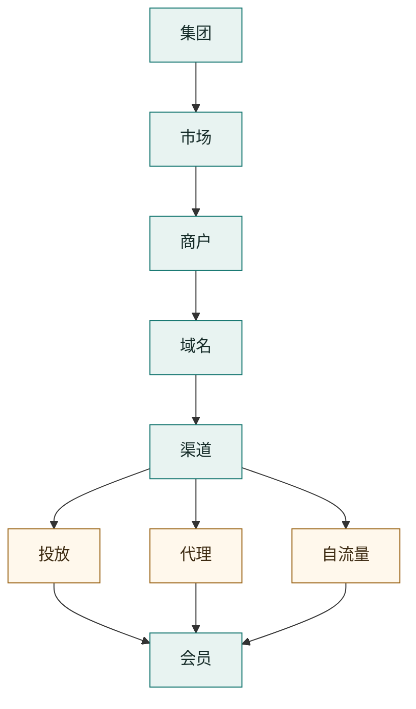

# 集团 → 会员 层级树状图说明

> 体系设计稿 · 参考《V2 核心体系设计 - 主线版》(`docs/v2-core-flows.html`)
> 适用范围:包网 SaaS 主骨架。本文只解释层级树状图本身,不展开字段、接口、表结构与异常状态机。

## §0 文档定位

本文档为下方层级树状图提供一份配套说明,自上而下讲清 **集团 → 市场 → 商户 → 域名 → 渠道 → 会员** 这条主线上每一层的含义、归属关系,以及它与 V2 核心体系模型的对应口径。

树状图回答的是"业务对象之间的从属与来源关系",不回答"谁从哪个端进入系统"。沿用 V2 的前置原则:**端是访问入口,不是业务层级**。平台端、商户端、代理端、会员端只是不同身份进入同一套业务体系的窗口,不出现在本层级树中。

## §1 树状图总览



纯文本视图:

```
集团
└─ 市场
   └─ 商户
      └─ 域名
         └─ 渠道
            ├─ 投放(付费广告)
            ├─ 代理(分销 / 推广)
            └─ 自流量(自然 / 私域)
                  ↓
                 会员
```

主线口径一句话:**集团下分市场,市场下挂商户,商户持有域名,域名承载渠道,渠道按来源分为投放、代理、自流量三类,三类渠道最终都把流量沉淀为会员。**

## §2 各层级说明

**集团** —— 最高归属与控制方,统管旗下多个市场与商户,负责整体策略、资源调配和全局口径。对应 V2 中的平台/最高控制方视角,是整条链路的顶层边界。

**市场** —— 按国家或地区划分的经营单位,承载币种、语言与本地化口径。它把同一集团下面向不同地区的经营拆分开,使各市场的金额、风控阈值、活动档位和本地化配置互不混用。对应 V2 的"市场模板"概念(以国家为单位、币种与语言为属性)。

**商户** —— 实际的运营主体与合同、计费、团队归属边界。一个商户可经营多个面向会员的经营单元,负责团队、运营、渠道投放、资金运营和日常配置。商户是经营责任的承载层。

**域名** —— 商户/品牌级的入口资产,负责把访问请求落到确定的经营上下文。一个经营单元可拥有主站域名、推广域名、落地域名和备用域名。**域名先确定上下文,渠道再确定来源**;域名不归属于渠道,渠道启停或删除不改变域名归属,也不改写历史会员来源。

**渠道** —— 挂在域名之下的"来源归因容器",用于统计与运营管理。渠道可绑定本经营单元下已配置、可用的域名生成推广入口,但不能跨经营单元借用域名。渠道详见 §3。

**会员** —— 面向 C 端的玩家主体,是注册、钱包、投注、活动、VIP、邀请关系的承载者。会员严格按经营单元隔离:在 A 注册的会员进入 B 应视为 B 的新会员,会员、钱包、订单、活动参与、VIP、佣金与客服记录都不跨单元混用。对应 V2 中的"玩家"。

## §3 渠道三分类(来源归因)

渠道层把会员的来源拆成三类。它回答的是"会员最初从哪个入口来",与"会员之间的推广关系(代理树)"以及"当前由哪个员工经营(业绩归集)"是三件独立的事,**同时存在但不混成同一个字段或同一个动作**。

**投放** —— 付费广告来源。来自广告链接、UTM、媒体买量、落地页或广告 campaign,用于核算投放效果、ROI 和广告渠道质量。对应 V2 的"广告投放"。

**代理** —— 分销 / 推广来源。由会员、邀请人或外部代理的邀请码、邀请链接带来,既产生来源归因,又形成会员之间的推广关系(代理树)。注意:外部代理本质是"会员 + 代理端只读查看能力",代理本人不作为渠道本体存在。对应 V2 的"邀请来源 / 代理体系"。

**自流量** —— 自然 / 私域来源。无明确推广参数的直接访问,以及商户自建的官方直推入口(线下二维码、KOL 专属链接、活动落地页等)。每个经营单元必须有一个默认自然流量入口作为兜底来源,不允许手工删除、不应关闭注册。对应 V2 的"自然流量 + 官方直推"。

来源优先级(简化口径):官方直推 → 广告/UTM → 可识别自然访问 → 有效邀请链接 → 未知来源。**原始来源一旦在注册时固定,员工划拨、撤销代理端、渠道关闭都不改写。**

## §4 与 V2 核心体系的对应关系

| 本树状图层级 | V2 核心体系对应 | 说明 |
| --- | --- | --- |
| 集团 | 平台 / 最高控制方 | 顶层归属与全局口径 |
| 市场 | 市场模板(国家市场) | 币种、语言、本地化与风控档位的边界 |
| 商户 | 商户 | 合同、计费、团队与经营责任边界 |
| 域名 | 域名(品牌级入口资产) | 先定上下文,不归属渠道 |
| 渠道 | 渠道 / 来源入口 | 来源归因容器 |
| ├ 投放 | 广告投放 | 付费买量,核算 ROI |
| ├ 代理 | 邀请来源 / 代理体系 | 推广关系 + 来源归因 |
| └ 自流量 | 自然流量 + 官方直推 | 兜底来源 + 自建私域入口 |
| 会员 | 玩家 | 经营单元内严格隔离 |

差异提示:本树状图在 V2 基础上做了两处归并/调整以便表达——一是把 V2 中"市场模板挂在商户之下"调整为"市场作为集团与商户之间的分层维度";二是把 V2 的四类来源(自然、广告、官方直推、邀请)收敛为投放、代理、自流量三类。落地到字段与配置时,仍以 V2 主骨架口径为准。

## §5 关键原则

1. **逐层从属,不跨层混用。** 上一层确定下一层的归属边界;会员、资金、订单等关键数据以经营单元为隔离边界。
2. **域名定上下文,渠道定来源。** 只有域名而无明确渠道信息时,进入该单元的默认自然流量入口。
3. **三套关系分离。** 来源归因(渠道)解释入口,代理体系解释会员之间的推广关系,业绩归集解释当前员工的经营责任,三者不可合一。
4. **历史事实不被改写。** 注册时的市场、商户、域名、渠道与来源会形成快照,后续配置调整、划拨、渠道关闭均不反向改写历史。
5. **不提供转代。** 不通过运营动作重排会员之间的代理树;员工间划拨只改经营归属,不改原始来源与代理树位置。

---

*配套树状图见会话中渲染的图示;如需将图示导出为 PNG / SVG / 内嵌 HTML,可另行生成。*
